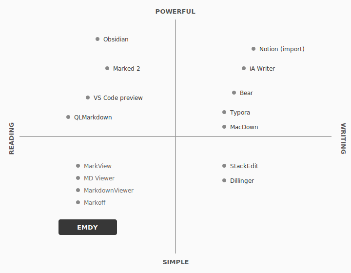

# Emdy — Competitive Landscape Report

## 1. Executive Summary

The macOS Markdown tool landscape is crowded with editors and note-taking apps but contains almost no purpose-built readers. Every established player — Typora, Obsidian, iA Writer, Bear — is fundamentally an authoring tool that happens to render Markdown as a byproduct of its editing workflow. The one notable exception is Marked 2, which is a previewer rather than an editor, but it targets writers who need a live-preview companion to their text editor, not non-technical people who just want to read a document. A small wave of newer entrants — MarkView, MD Viewer, MarkdownViewer, Markoff — have begun to occupy the "simple viewer" space, but none has achieved meaningful adoption or brand recognition. The "simple reader" quadrant is not empty, but it is severely underserved: the apps that exist there are unknown, underfunded, and lack the polish to become the default answer to "how do I open this .md file?"

Emdy's positioning as a native macOS Markdown reader — free, minimal, and designed for non-technical recipients of Markdown files — has no well-known direct competitor. The strategic risk is not that a competitor already owns this space, but that users may not know the space exists. Discovery, not competition, is the primary challenge.

---

## 2. Direct Competitors

### Full comparison table

| App | Type | Pricing | Platforms | Key Features | Install Base (est.) | Last Major Update | Reading Experience |
|-----|------|---------|-----------|-------------|---------------------|-------------------|--------------------|
| **Typora** | Editor (WYSIWYG) | $14.99 one-time (15-day trial) | macOS, Windows, Linux | Live preview, custom CSS themes, export to PDF/HTML/Word, math/diagrams, focus mode | Hundreds of thousands (no public figures) | Active, 2025 | Excellent rendering but you're always inside an editor. No "read-only" mode. Opening a file puts you in an editable document. |
| **Obsidian** | Knowledge management / editor | Free (personal use). Sync $4/mo, Publish $8/mo. Commercial license now free. | macOS, Windows, Linux, iOS, Android | Bidirectional linking, graph view, 2,000+ community plugins, vaults, canvas, local-first storage | 1.5M+ monthly active users | Active, 2025-2026 | Powerful but overwhelming for reading a single file. Requires creating a vault, learning the UI. Massive overkill for "just read this document." |
| **iA Writer** | Editor (distraction-free writing) | $49.99 one-time per platform | macOS, Windows, iOS, Android | Focus mode (sentence/paragraph), syntax highlighting, style check, content blocks, wikilinks, authorship tracking | ~500K+ users globally (per iA's own reporting) | Active, v7.3 (2025) | Beautiful typography but entirely writing-oriented. Preview is a secondary mode, not the default experience. Expensive for someone who just wants to read. |
| **Bear** | Notes app (Markdown-based) | Free (basic). Pro: $2.99/mo or $29.99/yr | macOS, iOS | Tag-based organization, nested tags, WikiLinks, focus mode, cross-device sync (Pro), encryption (Pro), multiple export formats | Millions (Apple Design Award 2017, large App Store presence) | Active, 2025-2026 | Notes app, not a file reader. You import content into Bear's database rather than opening .md files from Finder. Not designed for the "someone sent me a file" use case. |
| **Marked 2** | Previewer / writing companion | $13.99 (direct purchase) | macOS only | Live preview from any editor, 9+ built-in styles, custom CSS, export to HTML/PDF/DOCX/RTF, writing analysis (readability, word count), table of contents, Scrivener/Ulysses integration | Niche (tens of thousands, long-established among Mac power users) | v2.6.46, March 2025. Marked 3 beta announced Dec 2025. | The closest thing to a "reader" among established apps, but designed as a companion to a text editor. Targets writers who want to preview their own work, not recipients reading someone else's document. Feature-rich in ways a reader doesn't need (word count, readability scores, writing analysis). |
| **MacDown** | Editor (split-pane) | Free, open source (MIT) | macOS only | Split-pane editor/preview, live preview, syntax highlighting, customizable rendering, auto-completion | Moderate (9.7K GitHub stars on original repo). Original abandoned 2021; MacDown 3000 continuation active. | MacDown 3000 active. Original repo last commit 2021. | Split-pane editor. Reading experience is half the window. Not a standalone reader. |
| **QLMarkdown** | Quick Look extension | Free, open source | macOS only | Renders Markdown in Finder Quick Look (press Space), supports GFM, syntax highlighting, math, emoji, rmarkdown/MDX | Unknown (available via Homebrew, active GitHub repo ~3.7K stars) | v1.0.24, active in 2025 | Zero-friction preview in Finder. Good for glancing at files, but limited to the Quick Look panel — no navigation, no zoom, no print, no copy as RTF. Adequate for "what is this file?" but not for reading a long document. |
| **MarkView** (markview.io) | Viewer | Free | macOS, Windows, Linux | GitHub-style rendering, system theme detection, keyboard zoom, drag-and-drop opening, offline/private | Very small (new entrant, no significant traction visible) | Recent (2025-era launch) | Closest to Emdy's concept: "like Acrobat Reader, but for Markdown." Free, cross-platform, privacy-focused. However, built with Electron (not native), limited feature set, no meaningful brand recognition or distribution. |
| **MD Viewer** (md-viewer.com) | Viewer | Free | macOS, Windows | Clean typography, PDF export, dark mode, syntax highlighting, auto-generated TOC sidebar | Very small (new Mac App Store listing, minimal reviews) | Recent (2025-era) | Another "simple viewer" entrant. Available on Mac App Store. Minimal traction. |
| **MarkViewer** (markviewer.com) | Viewer + light editor | Free | macOS | GFM support, auto TOC, WYSIWYG editing, multi-tab, search, AI-assisted diff review, offline | Very small | v1.0.34 (recent) | Viewer with editing features creeping in. Universal binary (Intel + Apple Silicon). Minimal awareness. |
| **MarkdownViewer** (markdownviewer.app) | Viewer | Free | macOS | Directory tree organization, preview/source toggle, print/PDF export, built with Tauri + React | Very small (GitHub project) | Recent | Not a native macOS app (Tauri/React). Functional but not Mac-native in feel. |
| **Markoff** | Previewer | Free, open source | macOS | CommonMark rendering, YAML frontmatter, auto-reload, syntax highlighting via highlight.js, word/char count | Very small (thoughtbot project, ~600 GitHub stars) | Older (largely unmaintained) | Lightweight and fast (C-based CommonMark parser). Good concept but limited feature set and appears largely abandoned. |

### Key observations

1. **Every established app is an editor or notes tool.** Typora, Obsidian, iA Writer, and Bear all center on writing or organizing. Reading is a side effect, not the product.

2. **Marked 2 is the closest established competitor** but serves a different user: writers who want to preview their own work alongside a text editor, not non-technical people opening someone else's file.

3. **A cluster of small "viewer" apps has appeared** (MarkView, MD Viewer, MarkViewer, MarkdownViewer, Markoff) but none has achieved traction, brand recognition, or native macOS polish. Most are Electron/web-tech wrappers.

4. **QLMarkdown fills the zero-friction niche** (Quick Look in Finder) but is not a reading app — it's a glance tool.

---

## 3. Indirect Competitors

| Tool | How It's Used for Markdown Reading | Pros | Cons |
|------|------------------------------------|------|------|
| **VS Code preview pane** | Open .md file, press Cmd+Shift+V for side-by-side preview, or Cmd+K V for preview in separate tab | Already installed for many developers; decent GFM rendering; extensible via plugins (Markdown Preview Enhanced) | Intimidating for non-technical users. 1-2 second preview lag. Always feels like a code editor, not a reading experience. Default preview opens side-by-side with source. No export without extensions. |
| **GitHub web rendering** | View .md files in any GitHub repository; renders automatically | Excellent rendering quality; familiar to developers; handles GFM perfectly including tables, task lists, diagrams | Requires the file to be in a GitHub repo. Not useful for files received via email, Slack, or local disk. Requires a browser and GitHub account. Not a local tool. |
| **Dillinger** (dillinger.io) | Paste or upload Markdown content into browser-based editor; see rendered preview on the right | No install required; export to HTML/PDF; syncs with Dropbox/GitHub/Google Drive/OneDrive | Split-pane editor UI, not a clean reading experience. Requires uploading content to a web service (privacy concern). Friction of copy-pasting or uploading. |
| **StackEdit** (stackedit.io) | Browser-based Markdown editor with live preview | Offline mode, sync with Google Drive/Dropbox, rich feature set | Editor-first design. Requires a browser. Not a native file experience. Privacy concerns for sensitive documents. |
| **Notion import** | Import .md file into Notion workspace; view as a Notion page | Renders nicely once imported; familiar tool for many knowledge workers | Requires a Notion account. Import process loses some formatting (complex tables, LaTeX, custom HTML). Images must be hosted online. Not a "double-click and read" experience — it's a multi-step import workflow. |
| **pandoc CLI** | Convert .md to PDF/HTML via command line: `pandoc file.md -o output.pdf` | Extremely powerful; supports every Markdown flavor; produces high-quality output | Requires command-line knowledge, plus LaTeX installation for PDF output. Completely inaccessible to non-technical users. Multi-step process. |
| **ChatGPT / Claude "render this"** | Paste Markdown text into AI chat; it renders inline | No install; already open for many users; handles most Markdown well | Requires copy-pasting content into a chat. Not a file-based workflow. Inconsistent rendering of complex elements. Privacy concerns for sensitive documents. Requires internet connection. |
| **macOS Quick Look (raw)** | Select .md file in Finder, press Space | Zero friction — built into macOS | Shows raw Markdown source with syntax characters visible. Not rendered. Tables appear as pipes and dashes. Defeats the purpose entirely. |
| **TextEdit / Notes** | Open .md file with TextEdit | Already installed on every Mac | Shows raw plain text. No rendering whatsoever. |

### Why people reach for these

The common thread is that none of these tools was designed for reading Markdown files — people use them because they're already available, not because they're good at the task. The workarounds fall into two categories:

- **Developer tools used reluctantly** (VS Code, GitHub, pandoc): powerful but intimidating, require installation or accounts, not designed for reading
- **"Good enough" browser tools** (Dillinger, Notion, ChatGPT): accessible but break the native file experience, introduce privacy concerns, and require copy-paste workflows

The gap Emdy targets — a native macOS app where you double-click a .md file and read it like a PDF — is not served by any of these workarounds.

---

## 4. Positioning Map

**Axes:**
- **X-axis: Primary Intent** — Reading (left) to Writing (right)
- **Y-axis: Complexity** — Simple (bottom) to Powerful (top)

### Analysis

The bottom-left quadrant — simple tools focused on reading — is where Emdy sits. This quadrant is not empty: MarkView, MD Viewer, MarkdownViewer, and Markoff occupy it. But they are all unknown, underfunded, and lack native macOS polish. None has become "the answer" to the Markdown reading problem.

The top-right quadrant (powerful writing tools) is overcrowded: Obsidian, iA Writer, Bear, and Typora all compete intensely for writers. The bottom-right (simple writing tools) has Dillinger and StackEdit but is losing relevance as richer tools get easier to use.

The key insight: **the bottom-left quadrant has occupants but no winner.** The opportunity is not to create a new category but to be the first app that executes well enough in this space to become the default.

---

## 5. Pricing and Business Model Comparison

| App | Model | Price | Revenue Sustainability |
|-----|-------|-------|----------------------|
| **Obsidian** | Free core + paid services | Free (personal + commercial). Sync $4/mo, Publish $8/mo. | Estimated $25M ARR. Bootstrapped, profitable. Services revenue from a fraction of 1.5M users. |
| **iA Writer** | One-time purchase | $49.99 per platform | Sustainable for 15+ years. Premium positioning. Est. 500K+ users globally. |
| **Bear** | Freemium subscription | Free basic. Pro $2.99/mo or $29.99/yr | Sustainable. Apple ecosystem loyalty. Millions of downloads; conversion rate to Pro unknown but sufficient for a small team. |
| **Typora** | One-time purchase | $14.99 (15-day trial) | Sustainable. Small team, low overhead. No public revenue figures. |
| **Marked 2** | One-time purchase | $13.99 | Sustainable as a side project for a solo developer (Brett Terpstra). Niche but loyal audience. Marked 3 in development. |
| **MacDown** | Free, open source | Free | Community-maintained. No revenue. Original developer moved on. MacDown 3000 continuation is volunteer effort. |
| **QLMarkdown** | Free, open source | Free | Community-maintained. No revenue model. |
| **MarkView** | Free (planned premium features) | Free | Unclear sustainability. States core viewing will remain free. Future premium features not yet defined. |
| **MD Viewer** | Free | Free | Unclear sustainability. New entrant. |
| **MarkViewer** | Free | Free | Unclear sustainability. |
| **MarkdownViewer** | Free, open source | Free | No revenue model. |
| **Markoff** | Free, open source | Free | No active development. |
| **Emdy (planned)** | Free + tip jar | Free | Unproven. See analysis below. |

### Is "free + tip jar" unique or underfunded?

The tip jar model is uncommon in this space. Most competitors either charge upfront (Typora, iA Writer, Marked 2), use subscriptions (Bear), monetize services (Obsidian), or are open-source passion projects with no revenue (MacDown, QLMarkdown, Markoff).

The small viewer apps (MarkView, MD Viewer) are also free but have no visible monetization strategy, which raises questions about their long-term viability.

A tip jar for a utility app can work — RevenueCat case studies show meaningful revenue from tip jars in apps with strong daily usage patterns — but it requires a large installed base. For Emdy, the math is:

- A utility app used intermittently (when someone receives a .md file) will have lower tip conversion than a daily-use app
- Revenue depends on volume: a large number of occasional users tipping small amounts
- The model aligns well with Emdy's positioning ("free, no pressure") and builds goodwill
- Risk: tip revenue alone may not sustain development unless the user base reaches tens of thousands

The honest assessment: "free + tip jar" is not underfunded relative to competitors — it's appropriate for the product's scope and ambition. But it does mean Emdy needs to be capital-efficient and resist feature bloat that increases maintenance costs without increasing tips.

**Important platform note:** If Emdy distributes via direct download (not App Store), a tip jar can link to external payment (Buy Me a Coffee, Stripe, etc.) without Apple's 30% cut. If it ever goes to the App Store, tips must use In-App Purchase, and Apple takes its commission.

---

## 6. Switching Cost Analysis

### From Typora to Emdy

**What would make them switch:**
- Typora users who only read (never edit) Markdown are paying $14.99 for features they don't use. A free, simpler alternative is appealing.
- Typora always puts you in an editable document — there's no "reader mode." Users who accidentally modify files would appreciate a read-only app.

**What would prevent it:**
- Typora users who edit even occasionally won't switch — they'd need both apps.
- Typora's rendering quality is excellent. Emdy needs to match it.
- Typora's CSS theme ecosystem is deep. Power users have customized their setup.

**Verdict:** Low switching cost for read-only users, but read-only Typora users are a small subset. Most Typora users write.

### From Marked 2 to Emdy

**What would make them switch:**
- Marked 2 costs $13.99. Emdy is free.
- Marked 2 is designed as a writer's companion (live preview alongside an editor). Users who just want to read a file don't need that workflow.
- Marked 2's writing analysis features (readability scores, word count) are irrelevant to readers.

**What would prevent it:**
- Marked 2 users are typically writers who pair it with their editor. They're not Emdy's audience.
- Marked 2's export capabilities (HTML, DOCX, RTFD, ODT) are broader than Emdy's.
- Brand loyalty — Marked has been around since 2011 and has a devoted following among Mac power users.

**Verdict:** Marked 2 and Emdy serve different users. There's overlap only in the "I just want to preview a file" scenario. Not a significant switching opportunity.

### From VS Code to Emdy

**What would make them switch:**
- Developers who use VS Code for everything, including previewing Markdown, would appreciate a faster, cleaner reading experience for documents they're not editing.
- VS Code's preview has a 1-2 second lag, opens side-by-side with source by default, and feels like a code editor, not a reading experience.
- Non-technical users who were told to "install VS Code to read this file" would vastly prefer a purpose-built reader.

**What would prevent it:**
- Developers already have VS Code open. The friction of switching to another app for preview is real — Cmd+Shift+V is faster than opening a new app.
- VS Code's Markdown Preview Enhanced extension is very capable.
- Developers are not Emdy's primary audience.

**Verdict:** VS Code users are unlikely to switch for their own workflow. The opportunity is to intercept the non-technical person who was about to install VS Code on someone's recommendation.

### Is "simpler" a strong enough pull?

"Simpler" alone is not a strong switching motivator for people who already have a working solution. Users tolerate complexity in tools they've already invested time in learning. The switching motivation is not "simpler" — it's **"I don't have anything yet."**

Emdy's primary acquisition path is not switching existing users away from editors. It's capturing people who:
1. Have never installed a Markdown tool and just received their first .md file
2. Were told to install VS Code or Typora and thought "that seems like overkill"
3. Want to set a system default for .md files so they always open cleanly

The forcing function is not "simpler than Typora" — it's "double-click a .md file and it just works, like Preview.app for PDFs."

---

## 7. Gap Analysis — Where Is the White Space?

### The "simple reader" quadrant is occupied but ownerless

Several apps (MarkView, MD Viewer, MarkdownViewer, Markoff) sit in the same conceptual space as Emdy. None has won. The reasons:

1. **No native macOS quality.** Most are Electron/web-tech wrappers (MarkView uses Electron, MarkdownViewer uses Tauri/React). They don't feel like Mac apps. Emdy's Swift/SwiftUI native implementation is a genuine differentiator.

2. **No distribution or brand.** None of these apps has meaningful search presence, word-of-mouth, or community awareness. They exist but nobody finds them.

3. **No polish.** The small viewers lack the typography, rendering quality, and interaction design to feel trustworthy to non-technical users. They feel like developer side projects, not products.

4. **No clear positioning.** MarkView's tagline ("like Acrobat Reader, but for Markdown") is strong, but the execution doesn't match. MD Viewer mentions "typography inspired by Claude's artifacts" — the positioning is scattered.

### The real white space

The gap is not a missing product category — it's a missing *quality bar* within an existing category. The white space is:

- **A Markdown reader that feels like a first-party Apple utility** — native, fast, typographically excellent, and invisible in the way Preview.app is invisible
- **A Markdown reader that non-technical people can find** — SEO for "how to open md file on Mac," presence in "best Mac apps" lists, word-of-mouth from developers who recommend it to colleagues
- **A Markdown reader that becomes the system default** — registers as the .md file handler, so double-clicking just works

### What's defensible

Emdy's defensible advantages, if executed well:
- **Native macOS implementation** (Swift/SwiftUI) vs. Electron competitors
- **Design quality** matching macOS system app standards
- **Clear, narrow positioning** ("reads Markdown, nothing else") vs. competitors that add editing, AI features, or note-taking
- **Free with no friction** (no account, no subscription, no trial expiry)

### What's not defensible

- **Features.** Any competitor can add a "reader mode." Obsidian, Typora, or Bear could ship a read-only view tomorrow.
- **Price.** Several competitors are already free.
- **Technology.** Markdown rendering is a solved problem. The parsing/rendering itself is not a moat.

---

## 8. Strategic Implications for Emdy

### 1. The competition is irrelevance, not other apps

Emdy's biggest risk is not losing to Typora or Obsidian — it's that people don't know to search for a Markdown reader, or they settle for a workaround (asking the sender to export to PDF, pasting into ChatGPT, installing VS Code on a colleague's recommendation). Distribution and discoverability matter more than feature competition.

### 2. MarkView is the most conceptually similar competitor

MarkView (markview.io) occupies almost exactly Emdy's intended position: free, cross-platform, privacy-focused, viewer-not-editor. Its tagline ("like Acrobat Reader, but for Markdown") is essentially Emdy's pitch. Emdy's advantages over MarkView are: native macOS (vs. Electron), likely better typography and rendering quality, and tighter scope. But MarkView's cross-platform availability (macOS + Windows + Linux) is an advantage Emdy lacks.

### 3. QLMarkdown is a complementary threat, not a competitor

QLMarkdown (Quick Look extension) solves a subset of the problem with zero friction — press Space in Finder to preview any .md file. For the "glance at a file" use case, it's superior to opening any app. Emdy should consider whether to compete with QLMarkdown or complement it. A possible strategy: Emdy for reading, QLMarkdown for glancing — and Emdy could even recommend QLMarkdown installation for the Quick Look experience.

### 4. Marked 3 is worth watching

Brett Terpstra announced a Marked 3 beta in December 2025. If Marked 3 adds a simplified "reader mode" or targets non-technical users, it could become a direct competitor. Marked has brand recognition, a loyal user base, and a developer with deep macOS expertise. Monitor the Marked 3 beta closely.

### 5. The "free + tip jar" model is viable but fragile

No direct competitor uses a tip jar model. Most are either paid upfront, subscription, or free open-source with no revenue. The tip jar is differentiated but depends on volume. Emdy needs a substantial installed base (likely 10,000+ active users) before tips become meaningful revenue. Until then, development must be sustainable on zero revenue.

### 6. Native macOS is a real differentiator — for now

Most small Markdown viewers are Electron or web-tech based. Emdy's Swift/SwiftUI implementation makes it feel like a real Mac app, which matters for the "Preview.app for Markdown" positioning. However, this advantage erodes if Apple ever adds native Markdown rendering to Quick Look or Preview.app — an event that would validate the need but eliminate the product.

### 7. File association is the killer feature

The single most important technical feature is registering as the default macOS handler for .md files. If double-clicking a .md file opens Emdy, the product wins by being the path of least resistance. Every other feature (zoom, font switching, minimap) is secondary to this. The first-launch experience should prioritize helping users set Emdy as their default .md handler.

### 8. Developer word-of-mouth is the distribution strategy

Non-technical users don't search for "Markdown reader." They ask the developer or AI-savvy colleague who sent them the .md file: "I can't open this — what do I do?" If developers know about Emdy and recommend it, that's the primary acquisition channel. This means Emdy needs to be known and respected in developer communities (Hacker News, Reddit r/macapps, Mac developer blogs, GitHub) even though developers are the secondary audience.

---

## Sources

### Direct competitors
- [Typora](https://typora.io/) — official site, pricing, features
- [Obsidian](https://obsidian.md/) — official site; [pricing](https://obsidian.md/pricing)
- [Obsidian usage statistics](https://fueler.io/blog/obsidian-usage-revenue-valuation-growth-statistics) — 1.5M MAU, $25M ARR
- [iA Writer](https://ia.net/writer) — official site; [pricing](https://ia.net/writer/get/buy)
- [iA Writer 400K users milestone](https://ia.net/topics/400000-downloads-with-a-super-simple-app-business-insider)
- [Bear](https://bear.app/) — official site; [Pro pricing](https://bear.app/faq/features-and-price-of-bear-pro/)
- [Marked 2](https://marked2app.com/) — official site
- [Marked 2 on Mac App Store](https://apps.apple.com/us/app/marked-2-markdown-preview/id890031187)
- [Brett Terpstra — Marked series](https://brettterpstra.com/topic/marked/) — Marked 3 beta announcement
- [MacDown](https://macdown.uranusjr.com/) — official site; [GitHub](https://github.com/MacDownApp/macdown)
- [MacDown 3000](https://macdown.app/) — continuation project
- [QLMarkdown](https://github.com/sbarex/QLMarkdown) — GitHub, releases, features
- [MarkView](https://markview.io/) — official site
- [MD Viewer](https://www.md-viewer.com/) — official site; [Mac App Store](https://apps.apple.com/us/app/md-viewer/id6752493034)
- [MarkViewer](https://www.markviewer.com/) — official site
- [MarkdownViewer](https://markdownviewer.app/) — official site
- [Markoff](https://github.com/kaishin/markoff) — GitHub; [thoughtbot announcement](https://thoughtbot.com/blog/markoff-free-markdown-previewer)

### Indirect competitors
- [VS Code Markdown support](https://code.visualstudio.com/docs/languages/markdown)
- [VS Code Markdown preview performance issue](https://github.com/microsoft/vscode/issues/245841)
- [Dillinger](https://dillinger.io/) — browser-based Markdown editor
- [StackEdit](https://stackedit.io/) — browser-based Markdown editor
- [Notion Markdown import](https://www.notion.com/help/import-data-into-notion)
- [Pandoc user guide](https://pandoc.org/MANUAL.html)

### Market and pricing research
- [Obsidian pricing breakdown](https://www.eesel.ai/blog/obsidian-pricing)
- [Bear pricing on G2](https://www.g2.com/products/bear/reviews)
- [Tip jar monetization with RevenueCat](https://www.revenuecat.com/blog/engineering/building-a-tip-jar-feature-with-revenuecat/)
- [Apple In-App Purchase restrictions for tip jars](https://medium.com/@robert-baer/my-ongoing-battle-with-apple-over-a-buy-me-a-coffee-link-is-over-9c158df81c05)

### Comparison and roundup articles
- [Top macOS markdown editors 2026](https://heyally.ai/blog/mac-markdown-editors-2026/)
- [Best Markdown Editor for Mac (2025)](https://noteplan.co/blog/best-markdown-editor-for-mac)
- [Top 10 Markdown Editors (2026)](https://www.devopsschool.com/blog/top-10-markdown-editors-in-2025-features-pros-cons-comparison/)
- [Apple Community — viewing Markdown files](https://discussions.apple.com/thread/255993123)
